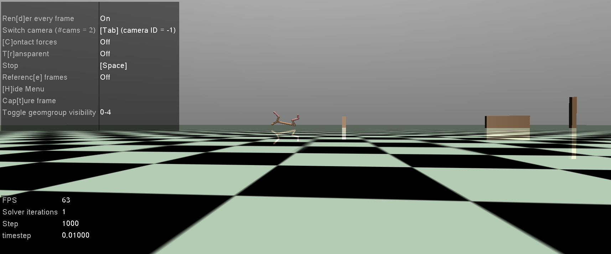

# Assignment 04 of Advanced Graphics (Simulation Methodology)

This reference code is for Assignment 4 of SNU Advanced Graphics. It is based on the Half Cheetah (V4) environment provided by OpenAI Gymnasium and uses the Proximal Policy Optimization algorithm, which is a popular DeepRL algorithm. The DeepRL code is from (https://stable-baselines3.readthedocs.io/en/master/) and the enviromnet is based on the Half_cheetah_v4 from https://github.com/Farama-Foundation/Gymnasium.


## Installation 

We checked this code works on Ubuntu 22.04.

```bash
cd {Project}

# make virtual enviroment 
python3.8 -m venv venv
source ./venv/bin/activate
 
(venv) pip install wheel
(venv) pip install "stable_baselines3[extra]>=2.0.0a9"
(venv) pip install gymnasium[mujoco]

```

## Learning and rendering

Without obstacles,
```bash
(venv) python main.py --model_path {model_path}
```

With obstacles,
```bash
(venv) python main.py --obstacle --model_path {model_path}
```

If the current timestep exceeds the total_timestep, the trained model will be saved in the model_path. If no model_path is specified, it will be saved with the name "model.zip".

## Only for rendering with trained model

```bash
# Use --obstacle when simulating with obstacles
(venv) python main.py --render (--obstacle) --model_path {model_path}
```

## Logging

Your training logs are stored in the "logs" directory. To view them, navigate to the directory and use "tensorboard --logdir=."
```bash
# Use --obstacle when simulating with obstacles
(venv) cd {Project}/logs/{current_logging_directory}
(venv) tensorboard --logdir=.
```

## Parameter tuning 

You can tune parameters such as gamma and lambda by passing arguments to the PPO constructor. For information about each argument, please refer to the documentation at https://stable-baselines3.readthedocs.io/en/master/modules/ppo.html. Additionally, in the main.py file, there is an example of adjusting the exploration noise scale (line 34).

## Reward and observation customization 

Design a reward or observation that allows the character to move as far as possible in the x-direction in a simulation with obstacles ("custom_half_cheetah.xml"). 



| Obstacle       | Position                               | Size                                           |
|------------|-------------------------------------------|------------------------------------------------|
| Obstacle #1 | (2.0, 0.0, 0.2) | (0.1, 0.1, 0.4) |
| Obstacle #2 | (10.0, 0.0, 0.2) | (1.0, 0.1, 0.4) |
| Obstacle #3 | (13.0, 0.0, 0.2) | (0.1, 0.1, 1.0) |


(Hint) To customize the reward in the HalfCheetah environment, you can modify lines 216 to 220 in custom_half_cheetah_v4.py. After understanding the environment structure through custom_half_cheetah_v4.py, you can design an appropriate reward function using obs and action for the simulation with obstacles ("custom_half_cheeta.xml").

(Hint) To customize the observation in your code, you need to modify the __init__(...) method to define the observation space and _get_obs(...) method to calculate the observation.

## Additional information 

Without obstacles, the model, trained over 500,000 timesteps, moves approximately 10 meters.


